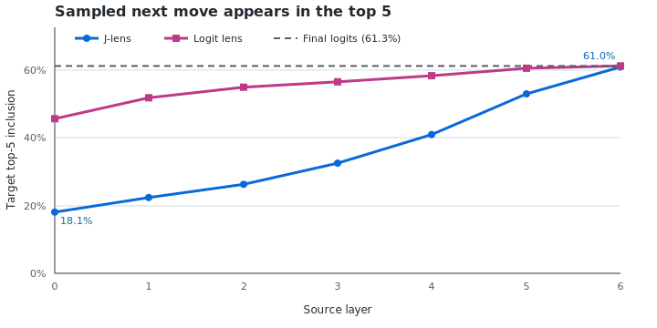
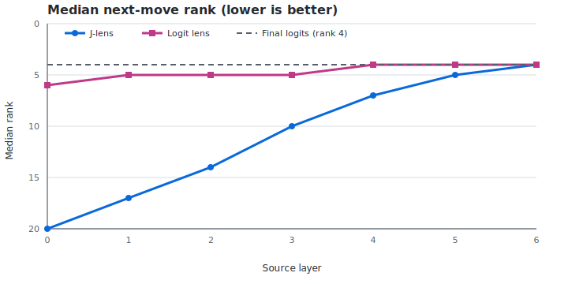

# OthelloGPT Jacobian Lens: Phase 1 reference

## Executive summary

We applied Anthropic's Jacobian Lens to the eight-layer OthelloGPT model as a
minimal non-language test. The experiment fitted average residual-stream
transport maps on 100 legal games and evaluated 4,298 next-move predictions
from 100 held-out games.

The Jacobian Lens becomes steadily more output-aligned with depth: sampled-target
top-5 inclusion rises from 18.1% at layer 0 to 61.0% at layer 6, while median rank falls
from 20 to 4. At layer 6 it nearly matches both the ordinary logit lens (61.3%)
and final model logits (61.3%). It does **not** outperform the logit lens at
earlier layers.

The appropriate conclusion is:

> Average-Jacobian transport yields increasingly coherent move-token readouts
> across OthelloGPT's depth, converging to the model's output disposition by
> the penultimate layer. In this model, however, the ordinary logit lens is a
> substantially stronger early-layer baseline.

## What the two lenses measure

For an intermediate residual activation `h_l`:

- **Logit lens:** decode `h_l` directly with the model's final normalization
  and unembedding. It asks which output tokens are already aligned with the
  model's vocabulary directions at layer `l`.
- **Jacobian Lens:** first transport `h_l` through an average Jacobian `J_l`
  fitted from layer `l` to the final residual basis, then apply the same final
  normalization and unembedding. It asks which output tokens this activation
  is, on average, linearly disposed to affect downstream.

In shorthand:

```text
logit_lens_l(h_l) = unembed(h_l)
j_lens_l(h_l)     = unembed(J_l @ h_l)
```

The J-lens is not a trained classifier and is not optimized for Othello labels.
It reuses Anthropic's average-Jacobian estimator unchanged.

| Property | Logit lens | Jacobian Lens |
|---|---|---|
| Transformation | Identity | Average downstream Jacobian |
| Extra fitting | None | Prompt corpus used to estimate `J_l` |
| Core question | What token directions are present now? | What token directions is this activation disposed to produce downstream? |
| State dependence | None | Averaged away during fitting |
| Othello interpretation | Direct move-token readout | Linearly transported move-token disposition |

## Corrected experiment

- Model: synthetic OthelloGPT TransformerLens checkpoint
- Architecture: 8 layers, residual width 512, vocabulary 61, context 59
- Othello encoding: playable squares are tokens 1–60; token 0 is unused
- Fit set: 100 seeded legal games
- Evaluation set: 100 separately seeded legal games
- Evaluation positions: after the first 16 moves, with a next-move target
- Total held-out predictions: 4,298
- Source layers: 0–6
- Target layer: 7
- Metric: rank of the particular sampled next move among all 61 output tokens

The corrected run is stored in `out/coffee_v2`. Earlier `out/coffee` artifacts
used an incorrect zero-based token map and must not be cited.

## Results





| Layer | J-lens target top-5 | Logit lens target top-5 | Difference | J-lens median rank | Logit median rank |
|---:|---:|---:|---:|---:|---:|
| 0 | 18.1% | 45.7% | −27.6 pp | 20 | 6 |
| 1 | 22.4% | 51.9% | −29.5 pp | 17 | 5 |
| 2 | 26.3% | 55.0% | −28.7 pp | 14 | 5 |
| 3 | 32.6% | 56.6% | −24.0 pp | 10 | 5 |
| 4 | 41.0% | 58.4% | −17.4 pp | 7 | 4 |
| 5 | 53.0% | 60.6% | −7.5 pp | 5 | 4 |
| 6 | 61.0% | 61.3% | −0.3 pp | 4 | 4 |
| Final logits | 61.3% | — | — | 4 | — |

### Main comparison with logit lens

The logit lens is much stronger in early and middle layers. This suggests that
OthelloGPT's residual stream is already fairly aligned with its output basis;
direct decoding preserves useful state-specific information that the global
average Jacobian does not improve. The J-lens averages over prompts, source
positions, future target positions, and nonlinear downstream regimes, so its
early-layer map can blur transformations that depend strongly on the current
board.

The gap closes monotonically after layer 2. By layer 6, only one residual block
remains and the average downstream transport is close enough to the local
computation that J-lens, logit lens, and final logits agree at the aggregate
level.

This is therefore a positive sanity check for **convergence and meaningful
transport**, but a negative result for **J-lens outperforming direct decoding**
on this model.

## Why target top-5 inclusion tops out near 60%

The held-out generator chooses uniformly among currently legal moves. There
are 9.3 legal continuations on average (median 10). Even a predictor whose top
five are all legal cannot know which legal move the random generator will pick;
its expected target top-5 inclusion on this sample is approximately 60.1%.

Final logits score 61.3% and layer-6 J-lens scores 61.0%, consistent with both
primarily recovering the legal-move set rather than predicting an intrinsically
preferred continuation. For that reason, sampled-target top-5 inclusion is a
convenient smoke metric but legal precision@5 and recall@5 are the better next
evaluation.

The examples support this reading:

- In the first example, all five layer-6 J-lens tokens are legal.
- In the second, all five layer-4 and layer-6 tokens are legal.
- In the third, the sole legal move appears in the top five from layer 2 onward
  and becomes top-1 at layers 5 and 6.

## What can and cannot be claimed

Supported:

- J-lens readouts become progressively more output-like across depth.
- Late-layer J-lens readouts contain strong legal-move information.
- Layer 6 essentially recovers final-model next-move ranking quality.
- The TransformerLens-to-J-lens adapter works on a non-language transformer.
- Logit lens is the stronger early-layer readout for this checkpoint.

Not supported:

- J-lens outperforms logit lens on OthelloGPT.
- Direct J-lens readouts decode board occupancy or a complete board state.
- A top-ranked token is the model's uniquely intended move; several moves may
  be legal and the evaluation continuation was randomly sampled.
- The current experiment establishes an advantage that will transfer to Evo2.

## Short version for discussion

> We reused Anthropic's average-Jacobian lens unchanged and adapted
> TransformerLens residual streams to it. On OthelloGPT, the transported
> readout improves smoothly from 18% to 61% sampled-target top-5 inclusion across layers and
> matches final-logit quality by layer 6. The ordinary logit lens is markedly
> better in early layers, so the result is not a J-lens performance win. The
> interesting signal is that average linear transport converges to a coherent
> legal-move disposition in a non-language model. These are move-token
> readouts—not decoded board-state labels.

## Recommended next analysis

The existing fitted lens can be reused; no refit is necessary. Extend evaluation
with:

1. legal precision@5 and recall@5 by layer;
2. invalid-token and token-0 rates;
3. paired J-lens-minus-logit-lens differences;
4. bootstrap intervals grouped by game;
5. optionally, a board-state probe/template bridge after the legal-move result
   is quantified.

For subspace analyses, distinguish the linear span of move J-vectors (a useful
matched-dimension proxy) from Anthropic's formal J-space, which imposes sparse
nonnegative decomposition and is not a linear subspace.

## References

- [Anthropic Jacobian Lens implementation](https://github.com/anthropics/jacobian-lens)
- [Anthropic: Verbalizable Representations Form a Global Workspace](https://transformer-circuits.pub/2026/workspace/index.html)
- [TransformerLens OthelloGPT demonstration](https://colab.research.google.com/github/neelnanda-io/TransformerLens/blob/main/demos/Othello_GPT.ipynb)
- Corrected machine-readable results: `out/coffee_v2/othello_eval.json`

> This direct J-lens decodes move tokens, not board-state labels. Legal-move
> enrichment is suggestive only; board occupancy requires a probe/template
> extension.
