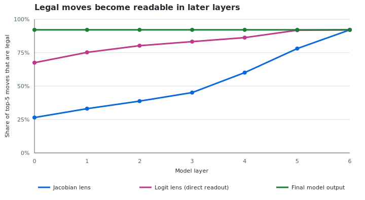
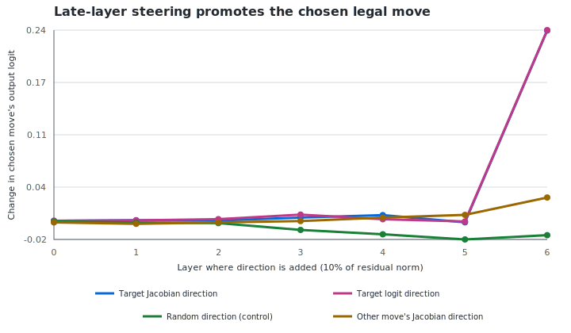
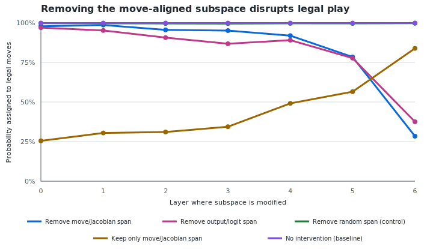

# A small action workspace in OthelloGPT

## Summary

We used a Jacobian lens to ask whether a tiny Othello-playing transformer develops a shared internal representation for selecting legal moves. The results point to a clear **late-stage action subspace**: by the final layers, move information is readable, targeted directions can causally promote particular moves, and removing the move-aligned subspace severely damages play.

This is encouraging evidence for a minimal workspace-like mechanism. It is not yet evidence for a fully general workspace: the effect is concentrated near the output, overlaps strongly with the ordinary logit readout, and occupies a substantial fraction of the final residual stream.

## 1. Legal moves become directly readable

The Jacobian lens was fit on 100 Othello games and evaluated on a separate 100 games. Its ability to identify the sampled next move rose steadily through the network: target top-5 inclusion increased from **0.181 at layer 0** to **0.610 at layer 6**, essentially matching the model's final logits at 0.613.

More importantly, the lens increasingly represented the *set of legal actions*, not just the sampled target. Legal precision among its top five moves rose from **0.265 to 0.921**, while total probability assigned to legal moves rose from **0.220 to 0.994**.

The ordinary logit lens is stronger in the early layers. The Jacobian lens catches up only near the end, suggesting that the network gradually transforms its internal state into an action-ready representation.

## 2. Move directions are causally writable

We next added small, norm-scaled interventions pointing toward selected move directions. At layer 6, writing the target move's Jacobian direction increased its final logit by **0.239**, compared with **-0.016** for a matched random direction and **0.031** for another move's Jacobian direction. The target improved by an average of 4.4 rank positions.

The causal effect is highly concentrated at layer 6, where Jacobian and ordinary logit directions behave almost identically. This supports a real action-writing interface, but currently looks more like a final action bottleneck than a workspace operating throughout the model.

Steering toward illegal moves raised their logits but almost never put them in the top five. The representation is therefore writable, while the surrounding computation continues to enforce strong legality constraints.

## 3. The action subspace is functionally privileged

At layer 6, the 60-dimensional linear span of move directions contains essentially all linearly probed legal-action information:

| Representation | Legal precision@5 | Target top-5 inclusion | Board-state accuracy |
|---|---:|---:|---:|
| Full residual stream | 0.916 | 0.426 | 0.369 |
| Move/Jacobian span | 0.916 | 0.588 | 0.346 |
| Orthogonal component | 0.606 | 0.231 | 0.371 |

The complementary component retains slightly more board-state information and nearly all player-identity information. This is the expected qualitative split between an action-facing representation and richer internal state, although the board probe is weak enough that this part should be treated as preliminary.

The causal ablation is much clearer:

| Intervention at layer 6 | Legal probability mass | Legal precision@5 | Mean target rank |
|---|---:|---:|---:|
| Baseline | 0.998 | 0.915 | 5.2 |
| Remove move/Jacobian span | 0.284 | 0.337 | 22.1 |
| Remove ordinary logit span | 0.376 | 0.480 | 17.2 |
| Remove matched random span | 0.997 | 0.914 | 5.2 |
| Keep only move/Jacobian span | 0.839 | 0.865 | 7.7 |

Removing the move-aligned span is catastrophic, while removing a random span of the same size has almost no effect. Conversely, retaining only the move span preserves surprisingly strong legal play. This is the strongest evidence that the subspace is functionally special rather than merely decodable.

## Interpretation

The most defensible conclusion is:

> OthelloGPT develops a late, causally writable, output-aligned action subspace that concentrates legal-move and next-action information while leaving more detailed state information outside it.

This satisfies a minimal workspace idea: information is gathered into a shared format that can be read and causally manipulated to control behavior. The stronger “general workspace” claim remains open. The span has rank 60 of 512, captures **59% of activation variance at layer 6**, and closely resembles the output/logit space. It may therefore be a specialized motor or action bottleneck rather than a general-purpose broadcast medium.

The most useful next test is a dimensionality sweep. Removing or retaining the top 1, 2, 4, 8, 16, 32, and 60 directions would show whether the causal effect is carried by a genuinely small core or distributed across the full move basis.
